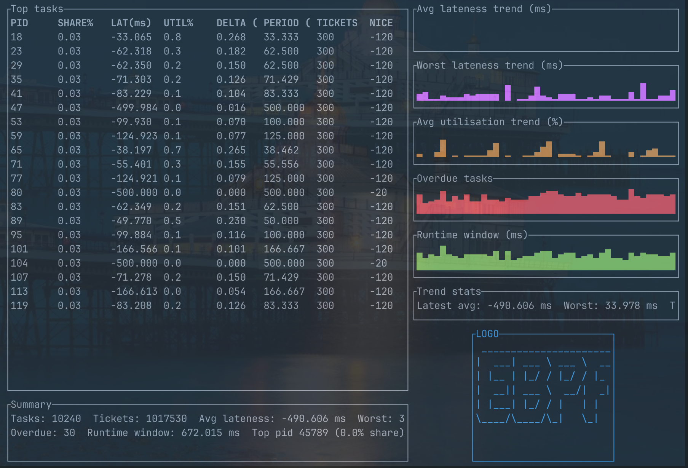

# eBPF Lottery Scheduler Monitor



This repo contains a tiny end-to-end stack for observing Linux scheduling events and deriving toy "lottery scheduler" metrics. The kernel side attaches to `sched:sched_switch` and stores per-PID stats (runtime, switches, nice-derived tickets). The user-space side periodically reads the pinned map, prints tables, runs lottery simulations, and appends rows to CSV for later analysis.

## Repository layout

```
bpf/                # eBPF program, vmlinux.h generator, Makefile
loader/             # libbpf-based loader that handles pin/attach
rust-runner/        # CLI that dumps & simulates scheduler metrics
tests/              # CPU-bound workload helper
scripts/run.sh      # unified entrypoint for build/load/dump/workload
docs/               # roadmap + debug reports
assets/             # example output such as stats.csv
```

## Prerequisites

- Linux with CONFIG_BPF + CONFIG_DEBUG_INFO_BTF (BTF available at `/sys/kernel/btf/vmlinux`).
- Toolchain: `clang`, `bpftool`, `make`, `pkg-config`, recent `libbpf` (>= 1.7).
- Rust toolchain (1.76 or newer) for the CLI.
- Root access for loading BPF programs (the helper script prompts for sudo).

## Quick start (recommended)

All common tasks are wired through `scripts/run.sh`:

```bash
# Build BPF object, loader, CLI, and test helpers
./scripts/run.sh build

# Load + attach the tracepoint (prompts for sudo, fixes bpffs/map permissions)
sudo ./scripts/run.sh load

# Launch a CPU-bound workload (non-root)
./scripts/run.sh workload --nice 5 --duration 10

# Dump stats every second, 5 samples, writing into assets/stats.csv
./scripts/run.sh dump --interval 1 --iterations 5 --output assets/stats.csv \
    --simulate-draws 20 --top 3

# Interactive terminal dashboard (press 'q' to exit)
./scripts/run.sh tui --refresh-ms 500 --top 12
```

The script also exposes overrides such as `MAP_PIN`, `PROG_PIN`, `LINK_PIN`, and `BTF_PATH`. Run `./scripts/run.sh help` for the complete list.

### What the script does

- `build`: regenerates `vmlinux.h`, builds `sched_lottery.bpf.o`, compiles the loader, the Rust CLI, and `tests/cpu_bound`.
- `load`: cleans previous pins, opens `bpf/sched_lottery.bpf.o` via the loader, attaches to `sched:sched_switch`, pins program/map/link under `/sys/fs/bpf/`, and relaxes permissions (directory `0755`, map `0644`) so the CLI can read it.
- `dump`: ensures the CLI binary exists, then re-executes it via sudo to obtain the required `bpf_obj_get` privileges while keeping user-provided arguments (interval/iterations/output, lottery simulation flags). Output tables include rolling metrics; CSV rows are appended to the chosen file (defaults friendly to `assets/stats.csv`).
- `workload`: builds (if needed) and runs `tests/cpu_bound` with the given nice/duration to create repeatable scheduler pressure.
- `tui`: launches the interactive dashboard (reuses the pinned map, same flags as the CLI `tui` subcommand).
- `unload`: removes pinned link/program/map to fully stop the tracer.

## Developing individual components

Although the script handles everything, the subdirectories remain self-contained:

- **eBPF program (`bpf/`)**  
  `make` regenerates `vmlinux.h` using `bpftool btf dump file /sys/kernel/btf/vmlinux format c` and produces `sched_lottery.bpf.o`. You can pass standard `BPF_CLANG/BPF_CFLAGS` overrides if needed.

- **Loader (`loader/`)**  
  A standalone `make` builds `sched_loader`, which accepts `--obj/--prog-pin/--map-pin/--link-pin/--btf`. This is useful for debugging load issues (e.g., `cfg.btf_path=/sys/kernel/btf/vmlinux` is printed for clarity).

- **Rust CLI (`rust-runner/`)**  
  `cargo run --release -- dump --map /sys/fs/bpf/task_map ...` works as long as the map is pinned and the binary is executed with CAP_SYS_ADMIN/CAP_BPF (use sudo or capabilities). The CLI links directly against libbpf via FFI, mirrors the `struct task_info` layout, adds exponential rolling averages, and can simulate lottery draws for forecasting.

- **CPU helper (`tests/`)**  
  `gcc -O2 tests/cpu_bound.c -o tests/cpu_bound` produces a small busy-loop utility with `--nice` and `--duration` flags.

## Lottery simulation & telemetry

The CLI (`dump` command) now includes scheduler-analysis helpers:

- `--simulate-draws N`: perform N lottery draws per iteration using the current ticket counts; prints winners plus win-rate vs theoretical share.
- `--top M`: show the top M candidates sorted by ticket share (default 5).
- `--alpha X`: configure the exponential moving average used for rolling runtime deltas (default 0.5).
- `--seed S`: optional RNG seed for reproducible lottery draws.
- `--json-output PATH`: append per-task NDJSON rows (easy to feed into jq, Grafana Loki, etc.).
- `--trace-output PATH`: emit Chrome trace / Perfetto-compatible events for time-line visualisations.
- `--deadline-warn MS`: print alerts whenever the heuristic EDF lateness exceeds MS milliseconds.

Example:

```bash
./scripts/run.sh dump --interval 1 --iterations 20 \
    --simulate-draws 50 --top 5 \
    --json-output assets/sched.ndjson \
    --trace-output assets/sched_trace.json \
    --deadline-warn 2 \
    --output assets/stats_m3.csv
```

The per-iteration table prints:

| Column | Meaning |
| ------ | ------- |
| `RUNTIME_MS` | Lifetime runtime observed by the eBPF program |
| `DELTA_MS` | Runtime delta since the previous sample |
| `ROLL_MS` | Exponential moving average of the delta |
| `PERIOD_MS` | Heuristic period derived from switch frequency within the sampling window |
| `LATENESS` | Estimated deadline miss (`delta_ms - period_ms`) |
| `UTIL%` | Estimated utilisation (`delta_ms / period_ms`) |
| `TICKETS` / `SHARE%` | Lottery tickets assigned from nice value + relative probability |
| `SW_DELTA` | Number of context switches observed in the last iteration |

CSV output now includes `estimated_period_ms`, `lateness_ms`, and `utilization` columns. NDJSON rows mirror the same fields, and the Chrome trace (if enabled) encodes each task's runtime delta as a `ph:"X"` slice with ticket/EDF metadata in `args`.

## Data workflow

1. Run one or more workloads with different nice values.
2. Keep the tracer loaded with `./scripts/run.sh load`.
3. Capture samples via `./scripts/run.sh dump --interval N --iterations M --simulate-draws 50 --output assets/stats.csv`.
4. Inspect `assets/stats.csv` / NDJSON / `trace_output` with your favorite plotting/analysis tool (CSV → pandas, NDJSON → jq, trace JSON → https://ui.perfetto.dev).

Use the printed lottery ranking and simulated winners to reason about (or compare against) your user-space scheduler experiments.

## Terminal dashboard (tui)

Prefer a quick at-a-glance view without external tools? `./scripts/run.sh tui` launches a `ratatui`-powered dashboard inside your terminal:

- Shows the top-N runnable tasks, ticket share, runtime deltas, estimated period, lateness, and utilisation.
- Highlights overdue tasks in red (same EDF heuristic as the batch dump).
- Left-hand side shows the sortable task table plus a summary panel with total tickets, avg/worst lateness, utilisation, overdue count, runtime window, and the hottest lottery candidate.
- Right-hand side stacks sparklines for avg/worst lateness, avg utilisation, overdue task count, and runtime window so you can spot trends even when absolute numbers look calm.
- Interactive keys: press `q` or `Esc` to quit. Arguments: `--refresh-ms` (default 1000), `--top N`, `--alpha` (rolling EWMA), `--map PATH`.

Because the TUI reuses the same pinned map, it still needs access to `/sys/fs/bpf/task_map`; the helper script automatically re-execs via sudo just like the batch `dump` command.

## Troubleshooting

- Loader or bpftool failing with `failed to parse target BTF`: ensure `/sys/kernel/btf/vmlinux` is readable and that the loader links against libbpf ≥ 1.7 (see `docs/ERROR_REPORT.md` for the full incident write-up).
- CLI reporting `Permission denied`: rerun `sudo ./scripts/run.sh load` so the script can reset bpffs permissions, then rerun `./scripts/run.sh dump …` (it will sudo only for access to `bpf_obj_get`).
- Need to inspect the map manually: `sudo bpftool map dump pinned /sys/fs/bpf/task_map`.

## Cleaning up

Use the helper script to detach and remove pins:

```bash
./scripts/run.sh unload
```

Or manually remove `/sys/fs/bpf/sched_lottery`, `/sys/fs/bpf/task_map`, and `/sys/fs/bpf/sched_lottery_link`.

## Roadmap

Planned milestones live in `docs/ROADMAP.md` (lottery simulation in user space, EDF metrics, etc.). Contributions welcome—open issues or PRs with improvements or portability fixes.
